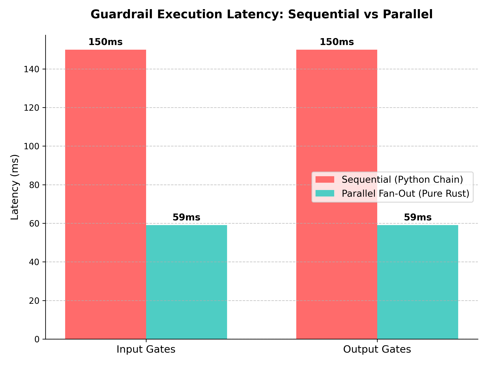

# ControlPlane Checker

An ultra-low-latency, production-shaped LLM guardrail pipeline built in pure Rust. ControlPlane Checker acts as an intelligent inference proxy sitting in front of and behind Large Language Models, executing synchronous heuristic prefilters, concurrent multi-model input classification gates (Coherence, PII, Toxicity, Intent/Prompt Injection), and concurrent output grounding verification gates (Hallucination, NLI Entailment) to ensure safe, verified, and cost-effective AI interactions.

---

## 1. Architecture

Every user interaction traverses a multi-tiered pipeline:

```
                    ┌─────────────────────────────────────┐
   User Query ─────▶│  Tier 0: heuristic prefilter (sync) │──▶ BLOCK (noise)
                    └─────────────────┬───────────────────┘
                                      │
                    ┌─────────────────▼───────────────────┐
                    │  Tier 1: INPUT GATES — all parallel │
                    │  ┌──────────┐ ┌─────┐ ┌──────────┐  │
                    │  │coherence │ │ pii │ │ toxicity │  │──▶ BLOCK (first failure
                    │  └──────────┘ └─────┘ └──────────┘  │     cancels the others)
                    │  ┌──────────┐                       │
                    │  │  intent  │                       │
                    │  └──────────┘                       │
                    └─────────────────┬───────────────────┘
                                      │ all pass
                    ┌─────────────────▼───────────────────┐
   history ────────▶│         LLM (Gemini or mock)        │
   summary          └─────────────────┬───────────────────┘
                                      │
                    ┌─────────────────▼───────────────────┐
                    │  Tier 2: OUTPUT GATES — parallel    │
                    │  ┌───────────┐ ┌─────┐              │──▶ BLOCK (ungrounded)
                    │  │ grounding │ │ nli │              │
                    │  └───────────┘ └─────┘              │
                    └─────────────────┬───────────────────┘
                                      │
                                 To User
```

### Request Lifecycle Walkthrough

1. **Tier 0 Prefilter (Synchronous Heuristics, <100 µs)**: Instant validation checks for character length boundaries, non-Latin script anomalies, and Shannon character entropy (detecting keyboard mashing). Bad requests are rejected before engaging asynchronous thread pools.
2. **Tier 1 Input Gates (Parallel Fan-Out, ~59 ms median wall-clock)**: Concurrently dispatches raw queries across Coherence, PII, Toxicity, and Intent classifiers. The first gate returning a `Block` verdict immediately aborts outstanding futures, saving compute and canceling the downstream LLM call.
3. **LLM Generation (Gemini 2.0 Flash or Mock Backend)**: If all Tier 1 gates pass, the sanitized query and optional compressed conversation history are forwarded to the LLM.
4. **Tier 2 Output Gates (Parallel Fan-Out, ~59 ms median wall-clock)**: The candidate response is evaluated against the conversation history for hallucinations and ungrounded statements using cross-encoder NLI / HHEM grounding backends.
5. **Response Delivery**: If grounded, the response is returned to the user alongside comprehensive per-gate scores, explainability metadata, and millisecond timing breakdowns.

---

## 2. Why the Gates Run in Parallel (Sum vs. Max)



In traditional sequential guardrail chains, overall latency equals the **sum** of all individual gate latencies:

$$\text{Latency}_{\text{chain}} = T_{\text{coherence}} + T_{\text{pii}} + T_{\text{toxicity}} + T_{\text{intent}} \approx 15\text{ms} + 20\text{ms} + 18\text{ms} + 22\text{ms} = 75\text{ms}$$

Because every input gate depends solely on the raw user query, there are zero data dependencies between them. ControlPlane Checker fans out all gates concurrently onto a Tokio `FuturesUnordered` executor:

$$\text{Latency}_{\text{fan-out}} = \max(T_{\text{coherence}}, T_{\text{pii}}, T_{\text{toxicity}}, T_{\text{intent}}) \approx 22\text{ms}$$

Furthermore, if any gate (such as Toxicity or PII) flags a violation after 12 ms, the executor **immediately drops the remaining futures**, canceling all other outstanding ONNX inference tasks and short-circuiting the LLM generation.

---

## 3. Gate Reference

### 3.1. `prefilter`
- **Stage**: Input (Tier 0, Synchronous Heuristic)
- **Model**: None (Deterministic string analysis)
- **What it catches**: Empty queries, oversized payloads (>8000 chars), invalid character scripts (<50% expected script ratio), and high Shannon entropy (>4.2 bits/char keyboard noise).
- **Failure Policy**: Fail-open (`FailurePolicy::Open`).

### 3.2. `coherence`
- **Stage**: Input (Tier 1)
- **Model**: `madhurjindal/autonlp-Gibberish-Detector-492513457` (4 classes: `clean`, `mild gibberish`, `noise`, `word salad`)
- **Tuning**: Configured via single `strictness` dial in $[0.0, 1.0]$. Effective threshold is $1.0 - \text{strictness}$.
- **Failure Policy**: Fail-open (`FailurePolicy::Open`).
- **Known Weakness & Terse Keyword Risk**: Terse queries like `"best rust orm postgres"` or `"jodhpur weather tomorrow"` structurally resemble word salad to generic NLP models. To mitigate false positives, the gate skips inference on queries exceeding `max_tokens_for_model` (64 tokens) and fails open.

### 3.3. `pii`
- **Stage**: Input (Tier 1)
- **Model**: Regex + Luhn / Verhoeff Checksums + BERT NER (`dslim/bert-base-NER`)
- **Tuning**: `block_classes` (Payment cards, Aadhaar, PAN, Credentials), `observe_classes` (Names, Locations, Emails, Phones).
- **Failure Policy**: Fail-closed (`FailurePolicy::Closed`).
- **Design Rationale**: Blocking a user for typing their own email address is hostile. High-risk financial and cryptographic identifiers are strictly matched and blocked. Names and emails are captured as observations in telemetry only.

### 3.4. `toxicity`
- **Stage**: Input (Tier 1)
- **Model**: `martin-ha/toxic-comment-model` (2 classes: `clean`, `toxic`)
- **Tuning**: `threshold = 0.80`.
- **Failure Policy**: Fail-closed (`FailurePolicy::Closed`).

### 3.5. `intent`
- **Stage**: Input (Tier 1)
- **Model**: `testsavantai/prompt-injection-defender-base-v0-onnx` (Binary: `benign`, `attack`)
- **Tuning**: `threshold = 0.90` (deliberately conservative to prevent false rejections).
- **Failure Policy**: Fail-closed (`FailurePolicy::Closed`).

### 3.6. `grounding` & `nli`
- **Stage**: Output (Tier 2)
- **Model**: `cross-encoder/nli-deberta-v3-xsmall` (3 classes: `contradiction`, `entailment`, `neutral`) or Vectara HHEM-2.1-Open.
- **Tuning**: `threshold = 0.50`, `nli_weight = 0.35`.
- **Failure Policy**: Fail-closed (`FailurePolicy::Closed`).
- **Design Rationale**: NLI does not block independently; its contradiction/entailment signals are combined directly into the grounding risk score.

---

## 4. Quick Start (No Model Weights Required)

The service starts immediately in **stub mode** with synthetic, deterministic pseudo-inference if no ONNX models are present on disk.

```bash
# 1. Start the service
cargo run --bin controlplane-router

# 2. Check service readiness (returns 200 OK with stub inventory)
curl http://localhost:8080/readyz

# 3. Test a clean request (Decision: "allow")
curl -X POST http://localhost:8080/v1/check \
  -H "Content-Type: application/json" \
  -d '{"query": "How do I implement binary search in Rust?"}'

# 4. Test a trigger request (Decision: "block")
curl -X POST http://localhost:8080/v1/check \
  -H "Content-Type: application/json" \
  -d '{"query": "Test safety with trigger __STUB_BLOCK__"}'
```

### Deterministic Stub Triggers

| Trigger Substring | Target Gate | Synthetic Behavior |
|---|---|---|
| `__STUB_BLOCK__` | Any / All | Returns blocking score across active gates |
| `__STUB_BLOCK_COHERENCE__` | `coherence` | Simulates high word salad probability |
| `__STUB_BLOCK_TOXICITY__` | `toxicity` | Simulates high toxicity probability |
| `__STUB_BLOCK_INTENT__` | `intent` | Simulates prompt attack probability |
| `__STUB_BLOCK_PII__` | `pii` | Injects synthetic credit card identifier |
| `__STUB_BLOCK_GROUNDING__` | `grounding` | Injects high NLI contradiction |
| `__STUB_SLOW__` | Any | Injects 500 ms sleep to test timeout / degradation |

---

## 5. Downloading Model Weights

To run with live neural network weights:

```bash
# One-time tooling setup (offline only — not part of the runtime)
python -m venv .venv && source .venv/bin/activate
pip install "optimum[onnxruntime]" "transformers" "huggingface_hub[cli]"

# Prompt Guard 2 is a gated repo — accept the licence on its HF page first, then:
hf auth login

# Export each model to ONNX. optimum-cli writes model.onnx, tokenizer.json and
# config.json into the target directory, which is exactly what the loader expects.
optimum-cli export onnx \
  --model madhurjindal/autonlp-Gibberish-Detector-492513457 \
  --task text-classification models/coherence/

optimum-cli export onnx \
  --model martin-ha/toxic-comment-model \
  --task text-classification models/toxicity/

optimum-cli export onnx \
  --model dslim/bert-base-NER \
  --task token-classification models/pii_ner/

optimum-cli export onnx \
  --model testsavantai/prompt-injection-defender-base-v0-onnx \
  --task text-classification models/intent/

optimum-cli export onnx \
  --model cross-encoder/nli-deberta-v3-xsmall \
  --task text-classification models/nli/

# Verify every export against its PyTorch source BEFORE trusting it.
python bench/export_models.py --verify-all
```

### Int8 Quantization Warning
> [!WARNING]
> Quantization can silently corrupt model outputs, shift boundary logits, and alter classification behavior. Always re-run `--verify-all` and treat verification as a hard gate:
> ```bash
> optimum-cli onnxruntime quantize --onnx_model models/coherence --avx512_vnni -o models/coherence
> python bench/export_models.py --verify-all --tolerance 0.02
> ```

---

## 6. Configuration Reference

Configuration is loaded hierarchically: `config/default.toml` $\rightarrow$ `config/local.toml` $\rightarrow$ `CP_` environment variables.

| Key | Type | Default | Description |
|---|---|---|---|
| `server.bind` | string | `"0.0.0.0:8080"` | Socket bind address |
| `server.request_timeout_ms` | integer | `5000` | HTTP request timeout in ms |
| `server.max_body_bytes` | integer | `65536` | Max body size limit |
| `server.shutdown_grace_ms` | integer | `10000` | Graceful shutdown drain timeout |
| `pipeline.clarify_enabled` | boolean | `false` | Enables user-facing `Clarify` verdicts |
| `pipeline.input_gate_budget_ms`| integer | `120` | Wall-clock timeout budget for Tier 1 |
| `pipeline.output_gate_budget_ms`| integer| `200` | Wall-clock timeout budget for Tier 2 |
| `inference.pool_size_per_model`| integer| `4` | Independent ONNX sessions pooled per model |
| `inference.force_stub` | boolean | `false` | Force synthetic stub backend |
| `gates.coherence.strictness` | float | `0.55` | Single dial (0.0 permissive, 1.0 strict). Effective threshold = $1.0 - \text{strictness}$. |
| `gates.pii.block_classes` | array | `["payment_card", "aadhaar", "pan", "credential"]` | Blocking PII types |
| `gates.toxicity.threshold` | float | `0.80` | Probability threshold for toxicity block |
| `gates.intent.threshold` | float | `0.90` | Probability threshold for prompt attack block |
| `gates.grounding.threshold` | float | `0.50` | Ungroundedness threshold for output block |
| `gates.grounding.nli_weight` | float | `0.35` | Contributed weight of NLI signal |
| `llm.backend` | string | `"mock"` | `"mock"` or `"gemini"` |
| `llm.model` | string | `"gemini-2.0-flash"` | External LLM model identifier |
| `telemetry.log_format` | string | `"json"` | Log format (`"json"` or `"pretty"`) |
| `telemetry.metrics_enabled` | boolean | `true` | Enables `/metrics` endpoint |

---

## 7. HTTP API Reference

### `POST /v1/check`

#### Request Body
```json
{
  "query": "Can you explain how Tokio worker threads operate?",
  "session_id": "user-session-882",
  "history_summary": "User is building a high-performance network server in Rust.",
  "options": {
    "skip_gates": [],
    "dry_run": false
  }
}
```

#### Response 200 OK (Allowed)
```json
{
  "trace_id": "7bf3e1b0-9b4e-4b68-b8ce-c340d3fcf7d2",
  "decision": "allow",
  "response": "Here is the synthesized response to your request...",
  "blocked_by": null,
  "gates": [
    {
      "gate": "prefilter",
      "verdict": { "verdict": "pass" },
      "score": 0.0,
      "threshold": 0.0,
      "detail": { "len": 54, "script_ratio": 1.0, "entropy": 3.78 },
      "latency_ms": 0.08,
      "degraded": false
    },
    {
      "gate": "coherence",
      "verdict": { "verdict": "pass" },
      "score": 0.08,
      "threshold": 0.45,
      "detail": { "clean_prob": 0.92, "strictness": 0.55 },
      "latency_ms": 11.42,
      "degraded": false
    }
  ],
  "timings": {
    "prefilter_ms": 0.08,
    "input_gates_ms": 12.15,
    "llm_ms": 712.40,
    "output_gates_ms": 18.25,
    "total_ms": 742.88
  },
  "degraded_mode": false
}
```

#### Response 200 OK (Blocked)
```json
{
  "trace_id": "9ac18e01-382a-4a21-9dfa-80bb1e6b9112",
  "decision": "block",
  "response": null,
  "blocked_by": "pii",
  "gates": [
    {
      "gate": "pii",
      "verdict": {
        "verdict": "block",
        "reason": {
          "type": "pii_detected",
          "matched_classes": ["payment_card"]
        }
      },
      "score": 1.0,
      "threshold": 0.5,
      "detail": {
        "blocked_matches": [{ "class": "payment_card", "masked": "****-5678" }]
      },
      "latency_ms": 1.25,
      "degraded": false
    }
  ],
  "timings": {
    "prefilter_ms": 0.05,
    "input_gates_ms": 1.35,
    "llm_ms": 0.0,
    "output_gates_ms": 0.0,
    "total_ms": 1.40
  },
  "degraded_mode": false
}
```

---

## 8. Performance and Concurrency Notes

1. **`intra_op_num_threads(1)` and `inter_op_num_threads(1)`**: Parallelism comes from maintaining a pool of $N$ independent ONNX sessions per model, NOT from internal ONNX threading. Letting ONNX spawn its own threads causes massive context switching and degrades p99 tail latency under load.
2. **Strict `spawn_blocking` Wrapper**: `ort::Session::run` is a synchronous C-FFI call. Running it inside Tokio `async fn` bodies parks worker threads, starving the async reactor. All forward passes are executed strictly inside dedicated blocking worker pools.
3. **Saturation Metric (`cp_inference_pool_wait_seconds`)**: If this metric increases under load, it indicates requests are waiting for available session permits; scale up `inference.pool_size_per_model`.

---

## 9. Running Load Tests

> [!IMPORTANT]
> **The Gemini free tier will rate-limit you long before the guardrails saturate.** Load tests must run against `llm.backend = "mock"`.

```bash
# Run async load test at 16 concurrency across 500 requests
python bench/load_test.py --concurrency 16 --requests 500
```

---

## 10. Project Layout

```
controlplane-checker/
├── Cargo.toml                      # Workspace root manifest
├── rust-toolchain.toml             # Pinned stable toolchain
├── rustfmt.toml                    # Standard formatting rules
├── clippy.toml                     # Strict clippy configuration
├── .gitignore                      # Excludes target and models/**/*.onnx
├── .dockerignore
├── Dockerfile                      # Multi-stage container build
├── docker-compose.yml              # Service + volume mount configuration
├── README.md                       # Comprehensive system documentation
├── .github/
│   └── workflows/ci.yml            # CI workflow (fmt, clippy, tests, build)
├── config/
│   ├── default.toml                # Committed default configuration
│   └── local.example.toml          # Template for local secrets override
├── models/
│   ├── .gitkeep
│   └── README.md                   # Model download documentation pointer
├── crates/
│   ├── core/                       # Data models, verdict, context, errors, config
│   ├── inference/                  # ONNX session pool, tokenizers, stub, registry
│   ├── gates/                      # Prefilter, Coherence, PII, Toxicity, Intent, Grounding
│   ├── llm/                        # Mock generator, Gemini API client, history formatter
│   └── router/                     # Axum binary, handlers, pipeline, telemetry, shutdown
├── tests/
│   ├── integration_pipeline.rs     # Pipeline lifecycle and stub verification tests
│   ├── integration_api.rs          # Axum HTTP endpoint tests
│   └── fixtures/
│       └── coherence_eval.jsonl    # 60+ labelled coherence evaluation examples
├── benches/
│   └── gate_latency.rs             # Criterion microbenchmarks (fan-out vs chain)
└── bench/                          # Offline Python load testing and model export tools
    ├── load_test.py
    ├── corpus.py
    └── export_models.py
```

---

## 11. Roadmap & Known Limitations

- **v1 is Block-or-Pass Only**: The `Clarify` verdict variant is defined in the type system for forward compatibility, but is mapped to `Block` in v1 unless `clarify_enabled = true`.
- **HHEM Grounding Backend is Optional**: Vectara HHEM requires custom architecture export; the system defaults to the native `nli-deberta-v3-xsmall` cross-encoder backend.
- **Coherence Model is General-Purpose**: The underlying gibberish detector is trained on open-domain text; domain-specific keyword queries must be managed via the `strictness` tuning dial.
- **PII NER Findings are Informational**: In v1, Named Entity Recognition findings (Names, Locations) are recorded in response telemetry observations, but do not trigger request blocks.
