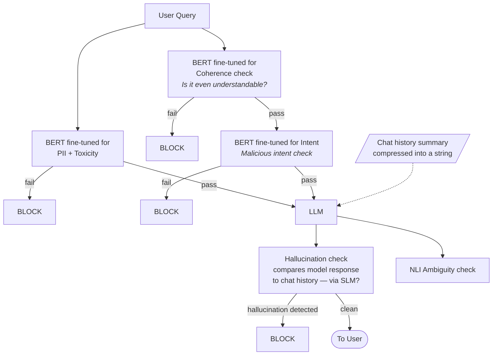

# LLM Guardrail Pipeline

Aggressive filtering: a user query passes through several classifier gates before and after the LLM. Any gate can block.

## Flowchart

## Stages

### Input guardrails (run on the user query)

| Stage | Model | Checks for | On failure |
|---|---|---|---|
| PII / Toxicity | BERT (fine-tuned) | Personal data leakage, toxic language | Block |
| Coherence | BERT (fine-tuned) | Whether the query is even understandable | Block |
| Intent | BERT (fine-tuned) | Malicious intent | Block |

The PII/toxicity branch and the coherence → intent branch run in parallel off the same query. Only a query that clears every gate reaches the LLM.

### Generation

The **LLM** receives the cleared query plus a compressed chat-history summary stored as a string.

### Output guardrails (run on the model response)

| Stage | Model | Checks for | On failure |
|---|---|---|---|
| Hallucination check | SLM (small language model) | Response contradicting chat history | Block |
| NLI ambiguity check | NLI model | Ambiguous / non-entailed claims | — |

A response that survives the hallucination check is returned **to the user**.